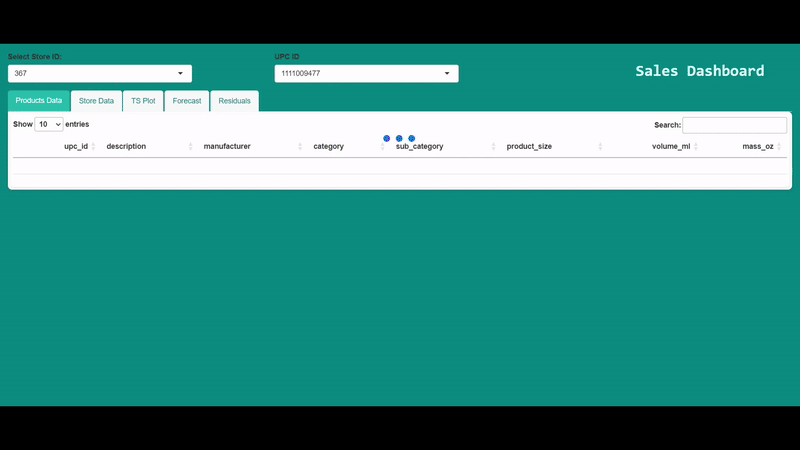

# Sales Time Series Analysis and Forecasting with R

Forecasted over 3,500 time series for various products across multiple stores, applying advanced forecasting models such as *ARIMA* and *STL+ETS*. Model's prediction error translates in average to ~$15 per week in potential revenue miscalculation. Forecasted data was integrated into an interactive dashboard, enabling real-time visualization and data-driven decision-making for enhanced inventory and sales strategy.
 

## Overview
- **Data Preparation**: Includes cleaning, transforming, and structuring the raw sales dataset.
- **Exploratory Data Analysis (EDA)**: Provides insights into the data, addressing promotional effects, outliers and features summary.
- **Model Validation**: Uses a sub-dataset to validate and select within the following models:
    - **ARIMA** and their variations: default, with lagged predictors, with seasonal predictors and both.
    - Seasonal descomposition with exponential smoothing applied to errors (**STL + ETS**).
    - Default neural network (**NNETAR**) with regressors.
    - Default **Prophet** model with regressors.

- **Model Fitting and Forecasting**: Applies the chosen models to the entire dataset to generate forecasts.
- **Results Storage**: Saves all predictions in a comprehensive and lightweight Parquet format for easy access and analysis.

## Shiny App Features
- **Interactive Interface**: Allows end users to search for specific stores and products.
- **Predictions Display**: Provides well-curated sales predictions for the selected store and product.
- **Residual Analysis**: Offers insights into the model performance through residual analysis.
- **Feature Correlation**: Displays correlations between features and sales, aiding in understanding the factors influencing sales.

## Getting Started
Shiny App can be run without any setup, click on [shinyapp.io](https://sagravela.shinyapps.io/sales-forecast-dashboard/). To run this locally, all the requirements are in `environment.yml` file.

## Dataset Overview: Breakfast at the Frat, a Time Series Analysis
Breakfast at the Frat contains a representation of sales and 
promotion information on five products from three brands 
within four categories (mouthwash, pretzels, frozen pizza, and 
boxed cereal), over 156 weeks. Included in this Source File:
Unit sales, households, visits, and spend data by product, 
store, and week.  
- Base Price and Actual Shelf Price, to determine a product’s 
discount, if any.
- Promotional support details (e.g., sale tag, in-store 
display), if applicable for the given product/store/week.
- Store information, including size and location, as well as a 
price tier designation (e.g., upscale vs. value).
- Product information, including UPC, size, and description.

## Tables

## transactions
**Description**: This table contains 156 weeks of Mouthwash, 
Pretzels, Frozen Pizza and Boxed Cereal transactions, at the 
product level by store, by week.  
**Number of records**: 524,950.  
**Features details**:  
`base_price`: Base price of item.  
`display`: Indicator of whether product was part of in-stroe display. 1 if on display, 0 if not.  
`feature`: Indicator of whether product was in in-store circular. 1 if in the circular, 0 if not.  
`hhs`: Number of purchasing households.  
`price`: Actual amount charged for the product at shelf.  
`spend`: Total spend (ie. dollar sales).  
`store_num`: Unique store identifier.  
`tpr_only`: Temporary price reduction only (ie. shelf tag only, product was reduced in price but not on display or in an advertisement). 1 if on temporary price reduction only, 0 if not.  
`units`: Units sold.  
`visits`: Number of unique purchases (baskets) that included the product.  
`week_end_date`: Week ending date.  
`upc`: Standard unique product code.  

## products
**Description**: Provides detailed product information for each upc in **transactions**.   
**Number of records**: 58.  
**Features details**:  
`category`: Category of the product.  
`description`: Product description.  
`manufacturer`: Manufacturer.  
`product_size`: Package size or quantity of the product.  
`sub_category`: Sub-category of the product.  
`upc`: Standard unique product code.  

## store
**Description**: Provides detailed store information for each store in **transactions**.  
**Number of records**: 79.  
**Features details**:  
`address_state_prov_code`: State.  
`parking_space_qty`: Number of parking spaces in the parking lot.  
`sales_area_size_num`: Square footage of store.  
`seg_value_name`: Designated store value segment. Possible values: Value, Mainstream and 
Upscale.  
`store_num`: unique store identifier.  

## CONTACT INFORMATION
For general questions about dunnhumby or the Source Files 
programme, or for technical questions regarding the use of this 
dataset, please contact:
**sourcefiles@dunnhumby.com**
